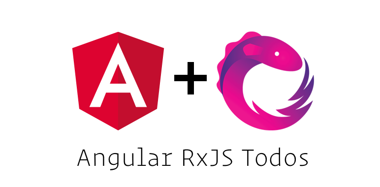

<p align="center">
  
</p>

# Angular RxJS Todos

This repo shows a basic todos example base on the famous [TodoMVC](https://github.com/tastejs/todomvc) but using RxJS and Angular. The goal is to show how to use the Observables data architecture pattern within Angular 2.

> Try the [live demo](https://rxjs-cn.github.io/angular-rxjs-todos/) here.

## Install

If you don't install `angular-cli` before, you need to install it at first:

```shell
npm install -g @angular/cli
```

Make sure you have the `angular-cli`, and then:

```shell
# clone the repo
git clone git@github.com:RxJS-CN/angular-rxjs-todos.git

# change into the repo directory
cd angular-rxjs-todos

# install dependencies
npm install

# run
npm start
```

Then visit [http://localhost:4200](http://localhost:4200) in your browser.

## React Version

If you prefer React, you can checkout out [React RxJS Todos](https://github.com/RxJS-CN/react-rxjs-todos)

## License

MIT
